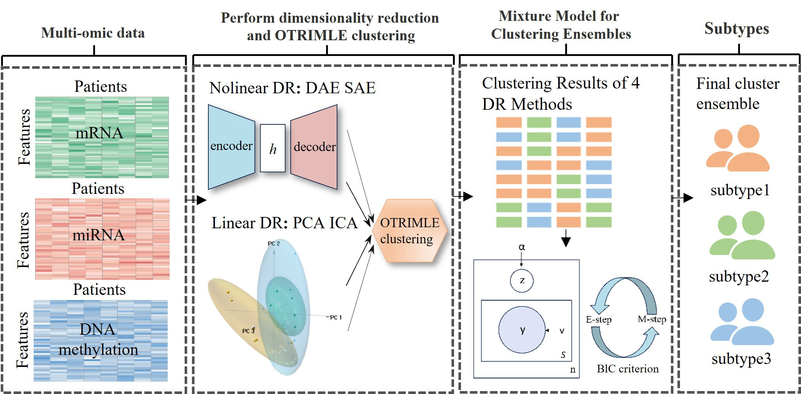

# CEDR


===========================================================================
## 1 Overview
Accurate subtyping is critical for guiding personalized treatment and improving clinical outcomes. However, the high dimensionality and inherent noise of multi-omics data present substantial challenges to robust cancer subtype identification. Here we propose a consensus robust subtyping method with ensemble dimensionality reduction for multi-omics data integration (CEDR). 

CEDR takes multi-omics data matrices as input and performs subtyping through a three-stage process: (1) Dimensionality reduction: four dimensionality reduction methods (DAE, SAE, PCA, and ICA) are used to reduce data dimensionality and mitigate noise, each capturing distinct structural features of the data; (2) OTRIMLE clustering: Based on the concatenated feature matrices obtained from each dimensionality reduction method, OTRIMLE is applied to generate robust clustering results that capture complementary subtyping structures across multi-omics data. (3) Mixture Model for Clustering Ensembles: The multiple subtyping results obtained from Step 2 are further integrated using the Mixture Model for Clustering Ensembles, yielding a consensus subtyping solution with enhanced robustness and consistency.

The CEDR package leverages dimensionality reduction, OTRIMLE, and the Mixture Model for Clustering Ensembles to generate a consensus subtyping solution with enhanced robustness and consistency.

## 2 Installation
Prior to running, please first install the following required R packages
```r
install.packages("h2o")
install.packages('otrimle')
install.packages('ica')
```

## 3 DEBUG
Please feel free to contact us if you have problems running our tool at zhaoyang9248@163.com.